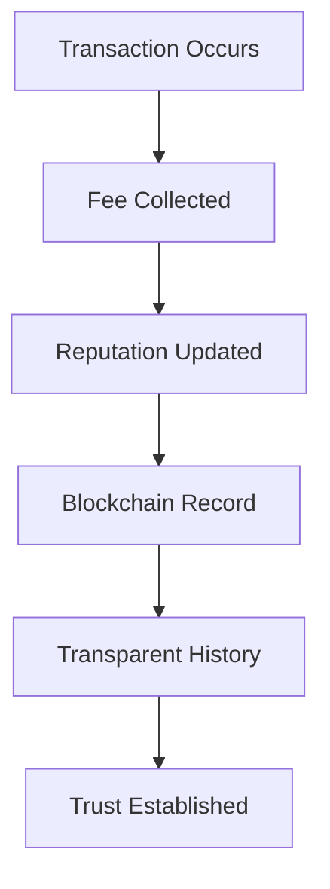
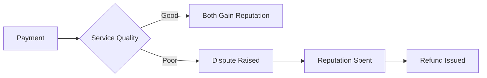
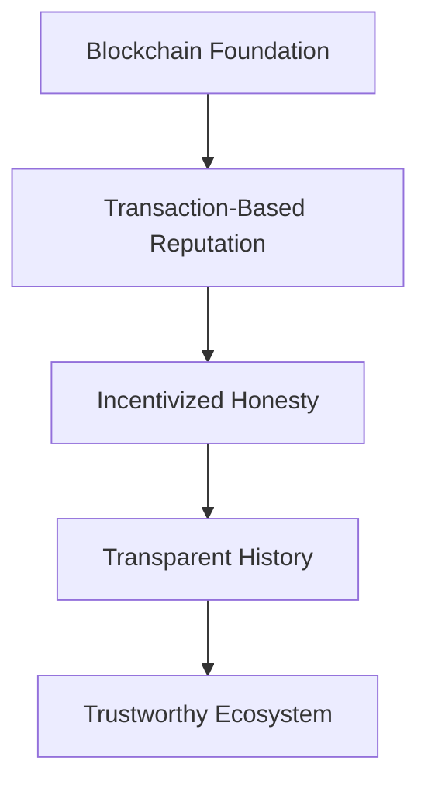

# 🌟 Reputation System in Decent Cloud

> _Building trust through transparent, blockchain-based reputation tracking_

<div align="center">


</div>

## 📋 Quick Reference

| Concept          | Description                                              |
| ---------------- | -------------------------------------------------------- |
| **Earning**      | Reputation points gained through successful transactions |
| **Spending**     | Using reputation points to dispute poor service          |
| **Transparency** | All reputation changes recorded on blockchain            |
| **Incentives**   | System rewards honesty, penalizes dishonesty             |

---

## Table of Contents

- [Overview](#overview)
- [How Reputation Works](#how-reputation-works)
  - [Earning Reputation](#earning-reputation)
  - [Public and Transparent](#public-and-transparent)
  - [Reputation as a Valuable Asset](#reputation-as-a-valuable-asset)
  - [High Standards of Conduct](#high-standards-of-conduct)
- [Why Use a Blockchain?](#why-use-a-blockchain)
  - [Tamper-Resistance](#tamper-resistance)
  - [Decentralized Trust](#decentralized-trust)
  - [Transparent Verification](#transparent-verification)
- [Reputation in Action](#reputation-in-action)
  - [Example Scenarios](#example-scenarios)
  - [Reputation Delta](#reputation-delta)
- [Interacting with the Reputation System](#interacting-with-the-reputation-system)
  - [Checking Reputation](#checking-reputation)
  - [Monitoring Changes](#monitoring-changes)
- [Best Practices](#best-practices)
- [Troubleshooting](#troubleshooting)
- [Frequently Asked Questions](#frequently-asked-questions)
- [Summary](#summary)

---

## Overview

<div align="center">



</div>

Decent Cloud's reputation system is designed to create a trustworthy ecosystem where participants can confidently engage in transactions. Unlike traditional rating systems, our approach ties reputation directly to real-world transactions and stores this information on a blockchain for maximum transparency and security.

> 💡 **Key Insight**: In Decent Cloud, reputation isn't just a score—it's a valuable asset that requires investment and careful stewardship.

---

## How Reputation Works

### Earning Reputation

✅ When a developer pays a node provider, the node provider is charged a 2% fee, and a portion of that fee funds further research and development. Both parties then gain a small reputation boost. In other words, consistent, successful transactions are the only way to build trust in the network.

<div class="info-box" style="background-color: #f0f8ff; padding: 10px; border-left: 5px solid #4682b4; margin: 10px 0;">
<strong>Example:</strong> A 100 DCT transaction results in +1 reputation point for both the developer and provider.
</div>

### Public and Transparent

📊 All reputation changes are recorded in smart contracts on a blockchain. This creates a transparent history that anyone can review, making it straightforward to distinguish reliable participants from less reputable ones.

<div align="center">

```
Transaction → Smart Contract → Blockchain → Public Record
```

</div>

### Reputation as a Valuable Asset

💎 Reputation takes time, quality service, and consistent transactions to earn. It can also be spent to penalize others for poor service. Spending reputation lowers both parties' scores—an intentionally costly action that discourages frivolous disputes. This ensures that disputes are raised sparingly and only when truly justified.

### High Standards of Conduct

🤝 Because reputation is intimately tied to real payments and visible to all, developers and node providers are motivated to maintain a high level of service and integrity. This system rewards honesty and discourages dishonest or malicious behavior.

---

## Why Use a Blockchain?

<div align="center">


</div>

Decent Cloud uses a blockchain to store reputation data for the following indisputable reasons:

### Tamper-Resistance

🔒 A blockchain's distributed ledger makes it extremely difficult for any single party to alter or erase past transactions. This ensures the historical integrity of reputation scores.

### Decentralized Trust

🌐 No central authority controls the ledger. Instead, a network of independent nodes collectively validates every reputation change. This prevents manipulation by any one person or organization.

### Transparent Verification

🔍 Every transaction and reputation update is visible to all participants. This openness makes it simple to verify claims about a participant's credibility without having to rely on a private or closed database.

---

## Reputation in Action

<div align="center">



</div>

### Example Scenarios

<details>
<summary>📋 <b>Successful Transaction</b></summary>

When a developer contracts cloud services from a provider:

1. Developer pays 100 DCT for the service
2. Provider delivers quality service
3. Transaction completes successfully
4. Both parties gain reputation points
5. The network becomes more trustworthy

```
Developer Reputation: +1 points
Provider Reputation: +1 points
```

</details>

<details>
<summary>⚠️ <b>Dispute Resolution</b></summary>

When service quality doesn't meet expectations:

1. Developer pays 100 DCT for the service (reputation +1 both for developer and the provider)
2. Provider delivers unsatisfactory service
3. Developer raises a dispute in the amount of 11 reputation points
4. Developer gets a refund in the amount of 11 DCT

```
Developer Reputation: -10 points (== +1 from the payment -11 for the dispute)
Provider Reputation: -10 points (== +1 from the payment -11 for the dispute)
```

</details>

<details>
<summary>🔄 <b>Long-term Relationship</b></summary>

When a developer and provider work together regularly:

1. Developer contracts services monthly for 500 DCT each month
2. Provider consistently delivers excellent service
3. After 12 months of successful transactions:

```
Developer Reputation: 12 * 5 = +60 points
Provider Reputation: 12 * 5 = +60 points
Trust Level: High
```

This established reputation makes both parties attractive to other network participants.

</details>

### Reputation Delta

It is important to keep track not only the total reputation points, but also the reputation changes over time:

<div class="info-box" style="background-color: #f0f8ff; padding: 10px; border-left: 5px solid #4682b4; margin: 10px 0;">
<strong>Reputation Delta Components:</strong>
</div>

- **Number of reputation increases**: How many positive interactions you've had
- **Value of reputation increases**: Total points gained from positive interactions
- **Number of reputation decreases**: How many disputes or penalties you've received
- **Value of reputation decreases**: Total points lost from disputes or penalties

<div align="center">

```
Reputation Health = (Increases ÷ Total Interactions) × 100%
```

</div>

> 📊 **Insight**: A participant with 100 increases of 1 reputation point each (+100 points total) and 2 decreases of 10 points each (-20 points total) has a net reputation score of +80, but more importantly, a 98% positive interaction rate.

---

## Interacting with the Reputation System

### Checking Reputation

You can check your current reputation score or another participant's score using the CLI:

```bash
# Check your own reputation
dc reputation --identity my-id

# Sample output:
# Identity: my-id
# Principal ID: abcde-12345-fghij-67890
# Reputation Score: 27
# Positive Interactions: 30
# Negative Interactions: 3
# Reputation Health: 90%
```

```bash
# Check another participant's reputation
dc reputation --principal-id abcde-12345-fghij-67890
```

### Monitoring Changes

Track changes to your reputation over time:

```bash
# View reputation history
dc reputation --history --identity my-id

# Export reputation data
dc reputation --export --format json --identity my-id > my_reputation.json
```

<div class="tip-box" style="background-color: #e6ffe6; padding: 10px; border-left: 5px solid #4caf50; margin: 10px 0;">
<strong>Pro Tip:</strong> Regularly export your reputation data to track your growth and identify patterns in your interactions.
</div>

---

## Best Practices

<div align="center">


</div>

1. **Regular Participation**

   - Engage in consistent, successful transactions
   - Complete contracts as agreed
   - Maintain high-quality service

2. **Dispute Management**

   - Only raise disputes for legitimate issues
   - Provide clear evidence when disputing
   - Respond promptly to disputes against you

3. **Reputation Building**

   - Start with smaller transactions to build trust
   - Gradually increase transaction volume
   - Participate in network validation

4. **Community Engagement**
   - Contribute to discussions
   - Help new participants
   - Suggest improvements to the reputation system

---

## Troubleshooting

<div align="center">

<table>
  <tr>
    <th align="center">Issue</th>
    <th align="center">Possible Cause</th>
    <th align="center">Solution</th>
  </tr>
  <tr>
    <td>Reputation not updating</td>
    <td>Transaction not confirmed</td>
    <td>Wait for blockchain confirmation (typically 5-10 minutes)</td>
  </tr>
  <tr>
    <td>Unexpected reputation drop</td>
    <td>Dispute filed against you</td>
    <td>Check disputes in <code>dc reputation --history</code></td>
  </tr>
  <tr>
    <td>Cannot view reputation</td>
    <td>Network connectivity issue</td>
    <td>Ensure connection to blockchain with <code>dc ledger-remote status</code></td>
  </tr>
  <tr>
    <td>Reputation lower than expected</td>
    <td>Recent disputes or penalties</td>
    <td>Review transaction history with <code>dc reputation --history</code></td>
  </tr>
</table>

</div>

For additional help:

- 📝 [Open an Issue](https://github.com/decent-stuff/decent-cloud/issues)
- 💬 [Join Discussions](https://github.com/orgs/decent-stuff/discussions)

---

## Frequently Asked Questions

<details>
<summary><b>How quickly does reputation update after a transaction?</b></summary>

Reputation updates occur as soon as the transaction is confirmed on the blockchain, typically within 5-10 minutes.

</details>

<details>
<summary><b>Can I transfer my reputation to another account?</b></summary>

No, reputation is non-transferable. It is tied directly to your identity and transaction history, making it a true reflection of your behavior in the network.

</details>

<details>
<summary><b>What happens if I lose access to my account?</b></summary>

If you lose access to your account but have your recovery phrase, you can restore your identity and associated reputation. This is why it's crucial to securely back up your recovery phrase.

</details>

<details>
<summary><b>Is there a maximum reputation score?</b></summary>

There is no hard cap on reputation scores. However, the value of each additional point diminishes over time, creating a natural soft ceiling that requires consistent positive behavior to maintain.

</details>

<details>
<summary><b>How does the dispute process work in detail?</b></summary>

When you raise a dispute:

1. You specify the amount of reputation you're willing to stake
2. This amount determines the maximum refund you can receive
3. Both parties temporarily lose the staked reputation
4. If the dispute is resolved in your favor, you receive your stake back plus a refund
5. If the dispute is rejected, you lose your staked reputation

This mechanism ensures that disputes are raised only when justified and with appropriate stakes.

</details>

---

## Summary

<div align="center">



</div>

By combining these blockchain benefits with a clear, transaction-based reputation model, Decent Cloud fosters an environment of accountability, trust, and fairness for all participants. The reputation system serves as the foundation of trust in our decentralized ecosystem, ensuring that all parties have incentives aligned with providing quality service and maintaining honest interactions.

The reputation system is not just a feature—it's the cornerstone of Decent Cloud's trustless architecture, enabling secure, reliable cloud services without requiring blind faith in unknown providers.

<div align="center">


</div>

---

<div align="center">

**[⬆ Back to Top](#-reputation-system-in-decent-cloud)**

</div>
